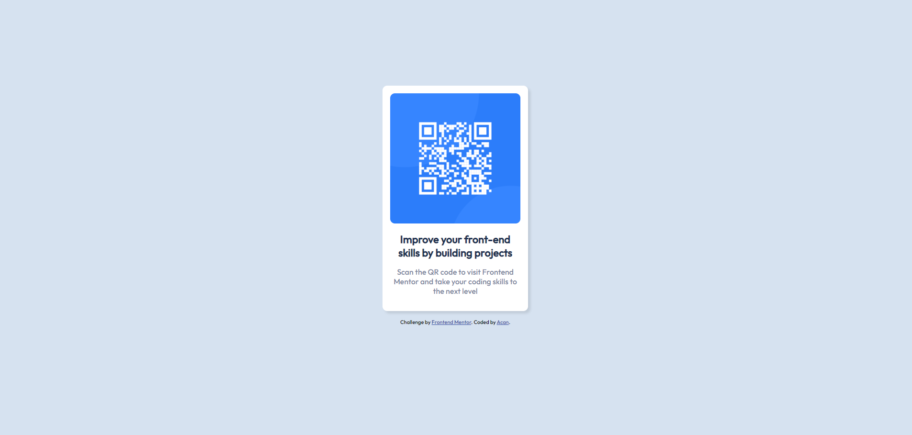
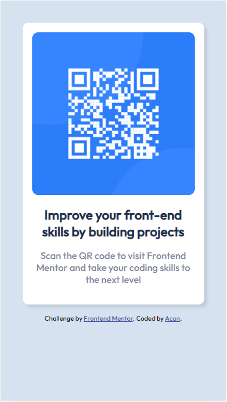

# Frontend Mentor - QR code component solution

This is a solution to the [QR code component challenge on Frontend Mentor](https://www.frontendmentor.io/challenges/qr-code-component-iux_sIO_H). Frontend Mentor challenges help you improve your coding skills by building realistic projects. 

## Table of contents

- [Overview](#overview)
  - [Screenshot](#screenshot)
  - [Links](#links)
- [My process](#my-process)
  - [Built with](#built-with)
  - [What I learned](#what-i-learned)
  - [Continued development](#continued-development)
  - [Useful resources](#useful-resources)
- [Author](#author)
- [Acknowledgments](#acknowledgments)


## Overview

### Screenshot





### Links

- Solution URL: https://github.com/Acanasmaz/QR-Code-Component
- Live Site URL: (https://acanasmaz.github.io/QR-Code-Component/)


## My process


### Built with

- Semantic HTML5 markup
- CSS custom properties
- Flexbox

### What I learned

I can say that this challenge has given me a lot. The use of flexbox was not explained to me in the css trainings I received, but after doing some research, I learned to use flexbox for this project in a very short time. I am open to all feedback.


```css
.flex-container {
  background-color: white;
  border-radius: 0.625rem;
  text-align: center;
  flex-direction: column;
  max-width: 17rem;
  margin: auto;
  margin-bottom: 1rem;
  padding: 1rem;
  box-shadow: 5px 5px 5px rgba(0, 0, 0, 0.1);
  margin-top: 10%;
}
```

### Continued development

I intend to develop and use this template while developing my own web3 projects.


### Useful resources

- [w3schools](https://www.w3schools.com/css/css3_flexbox_container.asp) - This site helped me a lot to understand flexbox.
- [Flexboxfroggy](https://flexboxfroggy.com/) - Helped me gain quick experience with Flexbox


## Author

- Frontend Mentor - [@Acanasmaz](https://www.frontendmentor.io/profile/Acanasmaz)
- Twitter - [@acaneatworld](https://www.twitter.com/acaneatworld)


## Acknowledgments

Talking to a friend who is much more experienced than me inspired me on some issues.


